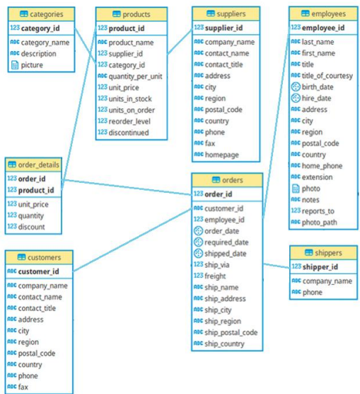
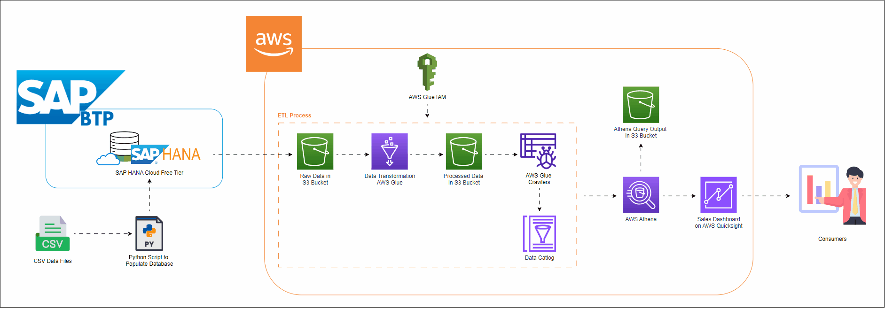

# Overview
This project demonstrates the implementation of a sales data pipeline using a combination of SAP HANA and AWS services. The goal is to extract, transform, and load (ETL) sales-related data from the Northwind dataset stored in SAP HANA and process it using AWS Glue and Amazon S3. Finally, the data is visualized through interactive dashboards in Amazon QuickSight.

## Tools Used
- **SAP HANA**: Cloud database used to store data.
- **AWS Glue**: ETL service that simplifies data preparation and movement.
- **Amazon S3**: Cloud storage used to store raw and processed data.
- **Amazon Athena:** Interactive query service that makes it easy to analyze data in S3 using standard SQL.
- **Amazon QuickSight**: BI tool used for data visualization and dashboard creation.
- **Python**: Programming language used for extraction, transformation, and loading scripts.
  
## Data Source: SAP HANA
SAP HANA is an in-memory computing platform that combines real-time data processing with data storage. It enables complex analyses and processing of large volumes of data with high performance. The key strengths of SAP HANA include:
- **Real-time Processing**: Enables real-time queries and analysis, facilitating quick, informed decisions.
- **High Performance**: The in-memory architecture offers superior speeds compared to traditional database solutions.
- **Integration**: Easily integrates with other tools and platforms like AWS Glue and Amazon QuickSight, enabling a seamless data pipeline.

## Data Population
The Northwind database data was used as the foundation to create and populate tables in SAP HANA. A Python script was developed to read CSV files containing the data and insert them into the corresponding tables. This process ensures the data is organized and ready for analysis. The database diagram illustrates the relationships between the tables, making it easier to visualize the data structure.

  

## Pipeline Scope

  

The pipeline is designed to:
1. **Extract data** from an SAP HANA database.
2. **Transform the data** using AWS Glue, applying cleaning and modeling.
3. **Load the processed data** into an S3 bucket.
4. **Analyze the data**  using Amazon Athena, which can query the data directly from S3.
5. **Visualize the data** via Amazon QuickSight, enabling the creation of reports and interactive dashboards based on the Athena queries.

## Dashboard
The dashboard serves as an interactive tool that allows users to visualize sales data effectively. It provides insights into sales performance, customer behavior, and operational efficiency, empowering stakeholders to make informed decisions.

  

To view the complete report, click the link below:
**[Full report](images/dashboard/sales_performance_dashboard.pdf)**

## Pipeline Benefits
With this pipeline, we can generate a **Sales Performance Dashboard** that allows us to:
- **Analyze customer behavior**, helping understand their preferences and shopping habits.
- **Monitor sales performance**, identifying trends and patterns.
- **Increase operational efficiency**, enabling data-driven decisions based on reliable and updated data.
- **Simplify data presentation** to stakeholders through intuitive and interactive visualizations.

## Detailed Implementation and Results
For a more in-depth explanation of the project and detailed implementation steps, you can check out my post on Medium that covers each phase of the pipeline setup and execution:
[Read the full post here]([https://medium.com/](https://medium.com/@paulodalst/end-to-end-sales-data-pipeline-with-sap-hana-and-aws-integration-fd84af9160db))
